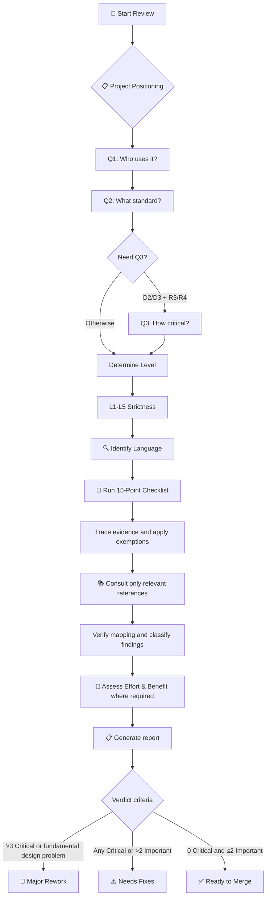

# Features

Detailed feature documentation for Clean Code Reviewer.

This file explains behavior for humans. `SKILL.md` is authoritative for workflow, reportability, severity, report format, and verdict rules. See [review-foundations.md](../references/review-foundations.md) for the complete authority model.

## 🎯 3+4+2 Project Positioning System

A refined questionnaire system that determines the right strictness level:

```
Q1: Who will use this code? (3 options)
├── 🧑 Solo — Only myself
├── 👥 Internal — Team/company
└── 🌍 External — External users/OSS

Q2: What standard? (4 options)
├── 🚀 Ship — Just make it work
├── 📦 Normal — Basic quality
├── 🛡️ Careful — Careful review
└── 🔒 Strict — Highest standard

Q3: How critical? (2 options, conditional)
├── 🔧 Normal — Can wait for fix
└── 💎 Critical — Outage if broken

→ Results in L1-L5 strictness level
```

## 🏷️ Five Strictness Levels

| Level | Name | Key Question | Examples |
|-------|------|--------------|----------|
| **L1** | 🧪 Lab | Does it run? | Experiments, scripts |
| **L2** | 🛠️ Tool | Understandable next month? | Personal tools |
| **L3** | 🤝 Team | Can teammates take over? | Team projects |
| **L4** | 🚀 Infra | Others suffer if broken? | Internal SDKs |
| **L5** | 🏛️ Critical | Can it pass audit? | Finance, medical |

## ✅ 15-Point Review Checklist

Quick but comprehensive review covering:

| Category | Checks |
|----------|--------|
| **Correctness** | Logic, boundaries, security |
| **Readability** | Naming, function size, comments |
| **Architecture** | SRP, DRY, dependency direction |
| **Testing** | Coverage, independence |
| **Advanced** | Concurrency, security, resources, performance |

## 📋 Standardized Reporting

Every review produces a consistent, visually clear report with detailed rule explanations. Metric thresholds are investigation signals; a threshold breach is reported only when evidence shows a concrete problem.

```markdown
## 📋 Code Review Report

**Project Positioning:** L3 Team
**Review Scope:** src/services/*.ts

### 🔴 Critical Issues (Must Fix)
- **[auth.ts:45] SQL query built with string concatenation**
  - Evidence: `query` concatenates `userId` directly from request parameters without sanitization at line 45
  - Rule: PP-72 (Keep It Simple and Minimize Attack Surfaces)
  - Principle: String concatenation in SQL creates injection vulnerabilities
  - Suggestion: Use parameterized queries
  - Effort: Low
    - Single file change, no cross-module impact
  - Benefit: High
    - Hot path -- every user query hits this code
    - Data loss/breach risk if exploited

### 🟡 Important Issues (Should Fix)
- **[user.ts:120] Function `processData` has 8 required positional parameters and unreadable call sites**
  - Evidence: Callers pass all 8 values positionally, so argument meaning cannot be understood without reopening the signature; L3 threshold is ≤5
  - Rule: CC-26 (Function Arguments)
  - Principle: The threshold breach is reportable because it creates a concrete readability and change-safety problem
  - Suggestion: Group related values into a parameter object
  - Effort: Medium
    - Touches callers across 3 files
    - Test updates needed for new signature
  - Benefit: Low
    - Internal utility, not on hot path

### 🔵 Minor Issues (Nice to Have)
- **[helpers.ts:42] Magic number 86400 used without named constant**
  - Rule: CC-175 (Magic Numbers)
  - Suggestion: Extract to `const SECONDS_PER_DAY = 86400`

### 📝 Verdict
⚠️ Needs fixes — Critical SQL injection issue must be addressed
```

## 🔧 Effort & Benefit Analysis

Each Critical and Important issue includes separate Effort and Benefit lines with nested reason bullets, showing repair difficulty and post-fix value to help teams decide fix order:

```
- Effort: Low
  - Single file change, no cross-module impact
- Benefit: High
  - Hot path -- every request hits this code
  - Data loss risk if triggered
```

- **Effort**: Low (< 30 min) / Medium (30 min - 4 h) / High (> 4 h)
- **Benefit**: Low (edge case, minor) / Medium (moderate) / High (hot path, severe)

Reason bullets derive from calibration questions: file count, cross-boundary impact, hot path frequency, worst-case consequence, and user workaround availability.

Severity is never downgraded by these values — a Critical issue stays Critical regardless of Effort or Benefit.

## 🔖 Rule Citation System

Every issue references its source rule for traceability and dispute resolution:

| Prefix | Source |
|--------|--------|
| **PP-##** | The Pragmatic Programmer |
| **CC-##** | Clean Code |
| **CA-##** | Clean Architecture |

## 🌐 Language-Aware Review

Rules are adjusted based on programming language paradigm:

| Paradigm | Languages | Applicability |
|----------|-----------|---------------|
| Pure OOP | Java, C# | ✅ Full |
| Multi-paradigm | TypeScript, Python, Kotlin | ⚠️ Adjusted |
| Functional | Haskell, Elixir, F# | ⚠️ Limited |
| Systems | Rust, Go, Zig | ⚠️ Different patterns |

## How It Works


